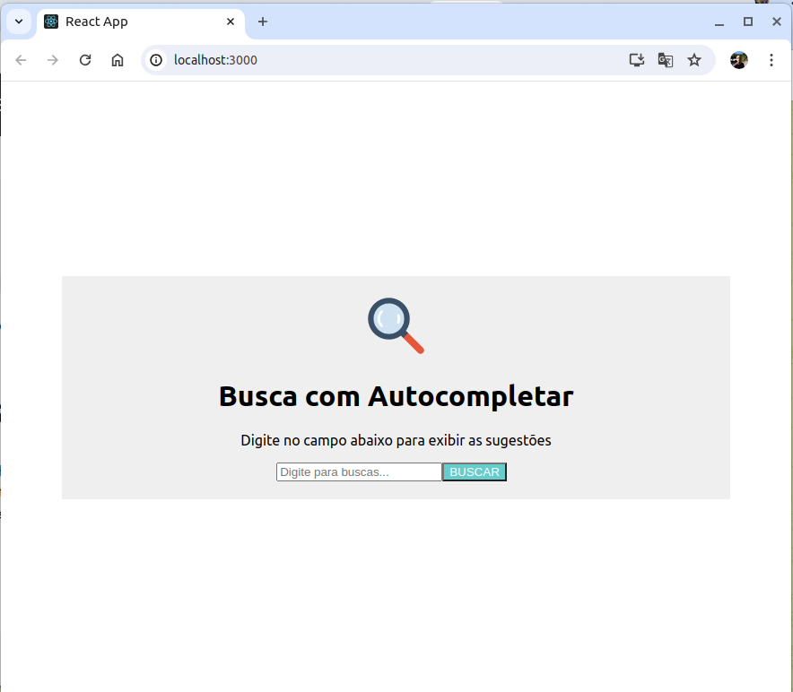

# Histórico do projeto
Aqui informarei o processo de desenvolvimento do projeto.

## Ler o enunciado

Como primeira etapa, irei ler o enunciado e anotar as informações importantes e verificar de maneira preliminar o que precisarei fazer.

- O projeto trata-se de a implementação de uma funcionalidade de auto-completar uma busca;
- Este repositório no Github vai ser utilizado para controle de versionamento do projeto e este que será entregue
- Deve funcionar no **Ubuntu** ou no **Mac OS**
- Vou precisar criar um arquivo YAML que vai ser executado com o comando '**docker-compose up**'
- O front-end vou usar o React
- GraphQL pra fazer requisições ao back-end/seridor/banco de dados
- Estou livre para escoher linguagem de back-end.


**REQUISITOS**

### Busca

- Pelo menos um campo para o usuário preencher o que deseja
- A interface gráfica é livre
- Posso definir um título para a busca ou placeholder
- Atenção: precisa ter uma boa exibição em aplicativos móveis

### Sugestões do Autocompletar

- Sugestões começam a ser exibidas após digitar o 4º dígito
- Em caso de não existir sugestãom nada é exibido
- Backend retorno no máximo 20 sugestões
- Porém, apenas 10 são exibidas
- O usuário deve poder rolar para ver mais sugestões
- A parte que o usuário já digitou fica em negrito
- Na ação de hover ou touch a sugestão é destacada
- Sugestões mudam conforme usuário digita
- Velocidade
- Após o clique, o campo é preenchido com o valor sugerido

### Lista de Sugestões / Persistência
- O BD pode ser populado com as sugestões (de maneira automatizada)
- Ou, poderei te rum arquivo com as sugestões em um arquivo

**AVALIAÇÃO DO DESAFIO**
- Atender as funcionalidades de auto-completar uma busca
- Qualidade do código é importante
- Facilidade de executar o projeto

## Inicio
O sistema Operacional que utilizarei para o desenvolvimento é:
**Ubuntu 22.04.4 LTS**

O navegador principal que utilizarei será
**Google Chrome**

Inicialmente irei fazer uma atualização do sistema e conferir as dependências que provavelmente precisarei no projeto.

```
sudo apt update
sudo apt upgrade
```

E as dependências que tenho instalados no sistema são
- NodeJS [ v20.9.0 ]
- Docker [version 27.0.3, build 7d4bcd8]
- Docker Compose [version v2.3.3]
- React [^18.3.1]
- GraphQL [^16.9.0]
- Apollo Server

## Milestones

Irei utilizar os serviços de issues e milestones do github para me guiar nas atividades e prazos. 


## Iniciar o FRONT END
Já pondo a mão na massa. Vou criar um projeto react com o comando:

```
npx create-react-app search_autocomplete
```

Para gerenciar os pacotes padrões do Node.js vou instalar no projeto o **npm** (Node Package manager) utilizando o comando abaixo:

```npm install``` 

Vou precisar de algo para poder de um ferramenta para gerir os dados do GraphQL e do próprio GraphQL, então no diretório search_complete irei executar o comando 

```
npm install @apollo/client graphql
```
Minha linha de pensamento para a construção da interface:
- Vou construir uma interface simples e com pouco detalhe gráfico. 
- Quero um interface intuitiva e agradável para a vista
- Os gráficos precisam ser responsivos, se adaptar ao tamanho de tela quando o usuário minimizar a tela
- Além disso, precisa ter uma boa visualização em interface mobile
- Preciso garantir que o funcionamento se estenderá a demais navegadores (Mozilla, Explorer, Safari, Edge, etc...)
- No ramo do código, valorizo muito organização e limpeza do código, acredito que o código precisa ser facilmente entendível
- No React irei criar um diretorio chamado Pages
- Nesse diretório Pages criarei dois arquivos, o primeiro Search.js, que representará o componente  de busca. E o Search.module.css, para os estilos.

### Search.js

Para iniciar o este será o primeiro componente que irei gerar. Retornando as frases básicas que estarão presentes na versão final;

```
function Search(){
    return (
        <h1>Busca com Autocompletar</h1>
        <p>Digite no campo abaixo para exibir as sugestões</p>
        <button>BUSCAR<button>
    )
}
```

### Search.module.css

Para os estilos do projeto, quero uma cor para o background cinza. A tela vai ter um painel representando o componente de busca, com as elementos presentes no componente Search. Esse painel deve ficar centralizado na tela e ser responsivo e se adapatar ao tamanho de tela.

Vou criar um seletor de classe **.search{}** para que eu possa setar a cor de fundo, o alinhamento, o espaçamento interno.

Assim, cheguei ao seguinte seletor

```
.search {
    background-color: #efefef;
    max-width: 100%;
    width: 80%;
    text-align: center;
    padding: 20px;
}
```

Inserir um imagem de uma lupa pois ela me remete a busca. Como a imagem é muito grande, precisei limitar a sua largura a 10%.

```
.search img{
    width: 10%;
}
```

Além disso, tenho o estilo para o **botão**. Desejo um botão com um cor diferente chamativa e que remeta levemente a cor da lupa acima. Quando o usuário passar com o mouse por cima do botão, ele deve mudar de cor para um azul mais escuro e o cursor do mouse deve mudar para "pointer" dando assim uma ideia de clique. 

```
button {
    background-color: #66cccc;
    color: #ffffff;
    margin-right: 10px;
}

button:hover{
    background-color: #2d2296;
    cursor: pointer;
}
```

Muita dessas alterações de estilo dependem da estilização do componente pai, como por exemplo a centralização da tela. Logo, eu vou precisar modificar o arquivo **App.css**. Observação que esse arquivo já vem criado quando rodamos o comando npx, porém apaguei ele completamente e criarei novamente na maneira que quero.

```
header {
  display: flex;
  justify-content: center;
  align-items: center;
  height: 100vh;
}

```

E esse é o resultado final da interface:




## Configuração do GRAPHQL

Tenho conhecimento básico em GraphQL, os projetos que trabalhei faziam conexão com a API através de REST interfaces. Porém, eu fiquei muito animado com o fato de poder desenvolver esse projeto em GRAPHQL pois isso significa que irei aprender algo novo.

Eu assisti um Playlist de videos no YouTube sobre GraphQL e a documentação no site oficial.


